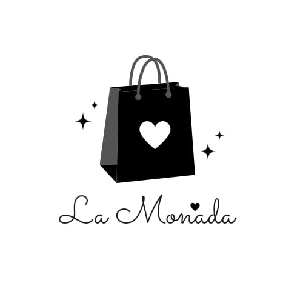

# APP_LA_MONADA

Nuestra app de ropa tr ofrece una experiencia de compra más fluida, personalizada y atractiva tanto para los usuarios como para las marcas, lo que la convierte en una herramienta fundamental para el éxito en el mercado actual.
## problema
Las tiendas de ropa enfrentan una serie de problemas más comunes son:
Competencia:
- Las tiendas online
-Marcas de moda rápida
-Tiendas de descuento
Cambios en el comportamiento del consumidor:
- Los consumidores son cada vez más propensos a comprar online
- La moda rápida fomenta la compra de ropa barata y desechable, lo que afecta a las tiendas que venden productos de mayor calidad y durabilidad.
Costos operativos:
- Los alquileres de locales comerciales son altos en zonas urbanas y comerciales
- Los salarios de los empleados y las leyes laborales
Inventario
- Mantener   un inventario grande y actualizado es costoso, especialmente en un mercado con tendencias cambiantes.
## solucion
nuestra app de ropa ofrece numerosos beneficios tanto para los usuarios como para las marcas:
Para los usuarios:
- Comodidad: Comprar ropa desde la comodidad del hogar, sin necesidad de desplazarse a una tienda física.
- Amplia selección: Acceso a una amplia gama de productos, incluyendo tallas, colores y estilos que podrían no estar disponibles en tiendas físicas.
- Filtrado y búsqueda avanzada: Facilidad para encontrar lo que se busca mediante filtros de talla, precio, color, estilo y marca.
- Recomendaciones personalizadas: Recibir sugerencias de productos basados en preferencias, historial de compras y tendencias.
- Ofertas y promociones exclusivas: Acceso a descuentos especiales, ofertas de lanzamiento y promociones exclusivas para usuarios de la app.
- Inspiración y tendencias: Explorar nuevas tendencias, estilos e ideas de looks a través de contenido multimedia como fotos y videos.
- Guardado de favoritos: Crear listas de deseos con productos que se quieren comprar más adelante.
Para las negociantes:
- Mayor alcance: Llegar a un público más amplio, incluyendo clientes potenciales que no visitan tiendas físicas.
- Aumento de las ventas: Promover productos y ofertas directamente a través de notificaciones push y emails.
- Mejor comprensión del cliente: Recopilar datos sobre las preferencias de los usuarios y su comportamiento de compra.
- Personalización de la experiencia: Ofrecer una experiencia de compra personalizada que se adapta a las necesidades individuales.
- Marketing digital efectivo: Utilizar la app para campañas de marketing digital y publicidad.
- Construcción de una comunidad: Interactuar con los usuarios y crear una comunidad en torno a la marca.
- Reducción de costos: Optimizar la gestión de inventario y las operaciones logísticas.
-Mayor fidelización: Fomentar la fidelidad del cliente a través de programas de recompensas y ofertas especiales.
## casos de usos
https://www.canva.com/design/DAGVJXEgrQU/ANeblmeIboq0-sro3XxH1g/edit?utm_content=DAGVJXEgrQU&utm_campaign=designshare&utm_medium=link2&utm_source=sharebutton
## Tecnologias de uso para hacer la app
- CANVA 
  es un documento fácil de entender que te ayudará a explicar tu negocio implicados a modelo de todos los Canva 

- PYTHON REFLEX
  Reflex es una biblioteca para construir aplicaciones web full-stack en Python puro. 

- FIGMA 
  ayuda a los equipos de diseño y desarrollo a crear mejores conjunto de productos

- TRELLO
  es una herramienta visual que permite a los equipos gestionar cualquier tipo de proyecto y flujo de trabajo, así como supervisar tareas
## Arquitectura
Tu app de comida utiliza la metodología Modelo-Vista-Controlador (MVC) por que optimizan su desarrollo y funcionamiento. 
La metodología MVC es ideal para nuestra app de comida porque proporciona una estructura clara y eficiente, permite realizar cambios y mejoras fácilmente, y mejora la experiencia del usuario. Esto se traduce en una aplicación más robusta y fácil de mantener.

## Metodologia de trabajo
LEAN
Las metodologías Lean son enfoques de gestión que se centran en la mejora continua y la eliminación de desperdicios para maximizar el valor para el cliente.

## LINKS
trello se hace la organizacion mi app
https://trello.com/invite/b/672cbafc3e37aa0a7aca54ed/ATTI81bf280ee66fc81c503b6cc5f9e9299b21C593DE/app-ropa
FIGMA me ayuda a crear las intefaces de mi app https://www.figma.com/design/Qz6ChRRjle2GtDnxjtriWj/Untitled?node-id=0-1&m=dev&t=u8HDSjg6ZRzjAFPn-1
## landigpeg
http://localhost:3000/
